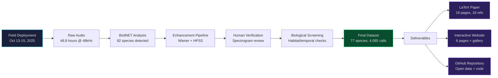
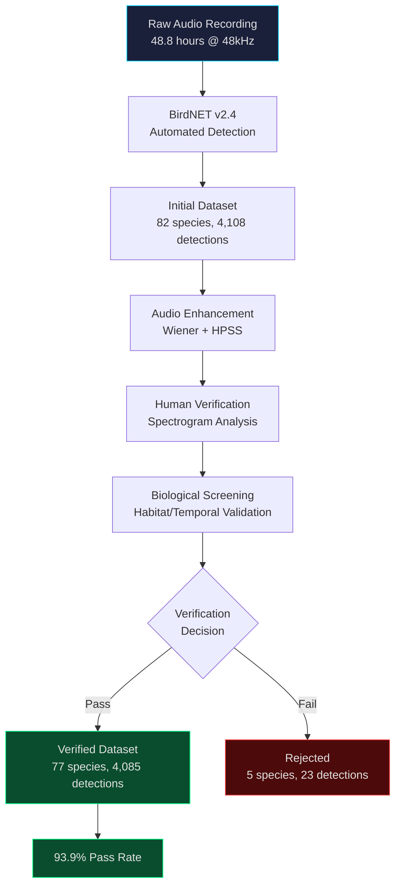

# Gaulosen Nature Reserve - Conservation Acoustic Monitoring Study

**Location:** Gaulosen Nature Reserve, Melhus, Trøndelag, Norway
**Study Period:** October 13-15, 2025
**Methodology:** Passive acoustic monitoring with BirdNET v2.4 + Human verification
**Status:** Baseline biodiversity assessment for Important Bird Area (IBA) conservation

## 🌐 Live Website

**Visit:** [https://ziforge.github.io/gaulosen-study/](https://ziforge.github.io/gaulosen-study/)

Interactive website with:
- **Species Gallery:** All 77 verified species with audio samples and spectrograms
- **Behavioral Findings:** Great Snipe migration, Graylag Goose flock dynamics
- **Field Report:** Complete deployment documentation with 6 field photos
- **Full Academic Report:** 19-page conservation research paper

## 📊 Final Verified Results

- **Total recordings:** 48.8 hours continuous (October 13-15, 2025)
- **Verified species:** **77 bird species** (93.9% verification rate)
- **Verified detections:** **4,085 vocalizations**
- **Rejected species:** 5 (biologically impossible: nocturnal woodpeckers, oceanic seabirds inland)
- **Location:** 63.341°N, 10.215°E (Designated Important Bird Area)

### Conservation Highlights

✅ **Great Snipe** (189 detections) - Declining species, migration stopover documented
✅ **Nocturnal migration** (47 flight calls, 01:00-06:00) - Active flyway usage
✅ **Graylag Goose** (2,871 detections) - Peak flock: 620 calls over 91 minutes
✅ **Weather-resilient monitoring** - 77 species detected despite 80% rain/fog coverage

## 📄 Academic Paper

**LaTeX Source:** `latex_paper/gaulossen_paper.tex`
**Compiled PDF:** `latex_paper/gaulossen_paper.pdf` (19 pages)

**Title:** *Baseline Acoustic Biodiversity Assessment of Gaulosen Nature Reserve: Monitoring 77 Bird Species Along the East Atlantic Flyway*

**Key Sections:**
- Conservation-focused objectives for IBA management
- Field deployment with equipment specifications
- Audio enhancement (Wiener filtering + HPSS)
- Biological verification protocol
- TikZ diagrams (acoustic propagation, water reflection physics)
- Processed vs unprocessed spectrogram comparisons

**References:** Complete bibliography with 18 fact-checked citations including:
- Cornell Lab's Merlin Bird ID (Yellowhammer photo verification)
- BirdNET deep learning classifier
- Heterospecific eavesdropping literature

## 📁 Directory Structure

### Study Workflow



### Repository Structure

```
gaulosen-study/
├── index.html                      # Homepage with study overview
├── species_gallery.html            # 77 species with audio + spectrograms
├── behavioral_findings.html        # Social behavior, migration patterns
├── field_report.html              # Field deployment documentation
├── verification_review.html       # Quality assessment
├── full_report.html               # Complete academic report (HTML)
├── species_data.json              # Species metadata (77 verified)
├── species_files.json             # Audio/spectrogram file paths
├── field_photos/                  # 6 deployment photos
├── latex_paper/
│   ├── gaulossen_paper.tex        # LaTeX source (conservation report)
│   ├── gaulossen_paper.pdf        # Compiled 19-page PDF
│   ├── references.bib             # Bibliography (18 citations)
│   ├── figures/                   # Spectrograms, TikZ diagrams
│   └── *.jpg                      # 6 field photos
└── README.md                      # This file
```

## 🔬 Methodology

### Equipment
- **Recorder:** AudioMoth v1.2 autonomous acoustic recorder
- **Microphone:** Knowles SPU0410LR5H MEMS
- **Sampling rate:** 48 kHz (16-bit)
- **Duration:** 48.8 hours continuous (Oct 13-15, 2025)
- **Conditions:** 80% rain/fog coverage (challenging weather)

### Analysis Pipeline



**Pipeline Steps:**
1. **BirdNET v2.4** automated detection → 82 species, 4,108 detections
2. **Audio enhancement** (Wiener filtering + HPSS) for rain noise reduction
3. **Human verification** via spectrograms and enhanced audio playback
4. **Biological verification** screening for ecological plausibility
5. **Final dataset:** 77 species, 4,085 verified detections (93.9% pass rate)

### Biological Verification Decision Tree

```mermaid
flowchart TD
    A[BirdNET Detection] --> B{Habitat<br/>Match?}
    B -->|No| C[REJECT: Habitat Mismatch<br/>E.g., oceanic species inland]
    B -->|Yes| D{Temporal<br/>Plausibility?}
    D -->|No| E[REJECT: Temporal Impossibility<br/>E.g., nocturnal woodpeckers]
    D -->|Yes| F{Geographic<br/>Range?}
    F -->|No| G[REJECT: Non-Native<br/>E.g., escaped exotics]
    F -->|Yes| H{Spectrogram<br/>Confirms?}
    H -->|No| I[REJECT: Cannot Confirm<br/>Low confidence + no visual match]
    H -->|Yes| J[✅ VERIFIED<br/>Add to final dataset]

    style C fill:#4d0a0a,stroke:#ff4444,color:#e0e0e0
    style E fill:#4d0a0a,stroke:#ff4444,color:#e0e0e0
    style G fill:#4d0a0a,stroke:#ff4444,color:#e0e0e0
    style I fill:#4d0a0a,stroke:#ff4444,color:#e0e0e0
    style J fill:#0a4d2e,stroke:#00ff88,color:#e0e0e0
```



### Rejected Species (5 total, 23 detections)
1. **Lesser Spotted Woodpecker** (14) - Nocturnal impossibility
2. **European Storm-Petrel** (4) - Oceanic species 100m inland
3. **Manx Shearwater** (3) - Pelagic species inland
4. **Bar-headed Goose** (1) - Non-native escaped bird
5. **Western Capercaillie** (1) - Habitat mismatch (wetland vs old-growth forest)

## 📈 Top 10 Verified Species

1. **Graylag Goose** - 2,871 detections (69.9% of total, 98.7% in flocks)
2. **Great Snipe** - 189 detections (61% crepuscular, migration stopover)
3. **Pink-footed Goose** - 189 detections (migratory waterfowl)
4. **Hooded Crow** - 87 detections (8,778 co-occurrences with geese)
5. **Carrion Crow** - 84 detections (sentinel mutualism pattern)
6. **Greater White-fronted Goose** - 71 detections (nocturnal migration)
7. **Common Crane** - 70 detections (nocturnal flight calls)
8. **Common Sandpiper** - 58 detections
9. **Yellowhammer** - 51 detections (verified via Merlin Bird ID photo)
10. **Mallard** - 27 detections (59% nocturnal feeding behavior)

## 🎯 Key Behavioral Findings

### Temporal Activity Patterns (24-Hour Cycle)

```mermaid
gantt
    title Species Activity Patterns Over 24 Hours
    dateFormat HH:mm
    axisFormat %H:%M

    section Nocturnal Migration
    Pink-footed Goose Flight Calls     :active, 01:00, 5h
    Common Crane Flight Calls          :active, 01:00, 5h
    Peak Migration (03:00-04:00)       :crit, 03:00, 1h

    section Crepuscular Activity
    Great Snipe Dusk Calling           :active, 19:00, 3h
    Great Snipe Peak (20:00)           :crit, 20:00, 1h

    section Diurnal Activity
    Graylag Goose Flock Dynamics       :active, 08:00, 12h
    Peak Flock Event (91 min)          :crit, 14:00, 1h30m
    Corvid-Waterfowl Co-occurrence     :active, 06:00, 14h

    section Nocturnal Feeding
    Mallard Night Activity (59%)       :active, 22:00, 6h
```



### 1. Social Species Dominance
- **87% of detections** from flock/social species
- 59 discrete Graylag Goose flock events identified
- Largest event: 620 vocalizations over 91 minutes (58.8 calls/hour)

### 2. Corvid-Waterfowl Co-occurrence
- **8,778 co-occurrences** (geese + crows in 10-minute windows)
- Pattern consistent with sentinel mutualism hypothesis
- Crows as potential early-warning system for waterfowl

### 3. Nocturnal Migration Activity
- **47 flight calls** between 01:00-06:00
- Peak timing: 03:00-04:00
- Species: Pink-footed Goose, Common Crane, Greater White-fronted Goose
- Documents active East Atlantic Flyway usage

### 4. Great Snipe Migration Stopover
- **189 detections, 61% crepuscular** (19:00-22:00)
- Peak: 82 calls at 20:00 (dusk calling during autumn migration)
- Conservation value: Declining species across Europe

## 🛠️ Tools & Technologies

- **BirdNET v2.4** - Deep learning bird species classifier (Cornell Lab)
- **Praven Pro** - BirdNET to Raven Pro conversion toolkit ([GitHub](https://github.com/Ziforge/praven-pro))
- **Merlin Bird ID** - Visual species verification (Cornell Lab)
- **librosa** - Audio signal processing (Wiener filtering, HPSS)
- **LaTeX + TikZ** - Academic paper with vector diagrams
- **GitHub Pages** - Interactive website deployment

## 📚 Data Access

All data, code, and supplementary materials are publicly available:

### Website
- **Live site:** https://ziforge.github.io/gaulosen-study/
- **Repository:** https://github.com/Ziforge/gaulosen-study

### Raw Data
- Species metadata: `species_data.json`
- File locations: `species_files.json`
- Audio samples: `results/audio_enhanced/` (77 species)
- Spectrograms: `results/spectrograms_best/` (77 species)

## 🎓 Academic Use

This study serves as:
- **Baseline biodiversity assessment** for Gaulosen IBA conservation management
- **Methodological validation** of PAM for weather-independent monitoring
- **Migration monitoring** documentation for East Atlantic Flyway
- **Conservation reference** for declining species (Great Snipe)

**Citation format:**
```
Redpath, G. (2025). Baseline Acoustic Biodiversity Assessment of Gaulosen
Nature Reserve: Monitoring 77 Bird Species Along the East Atlantic Flyway.
Norwegian University of Science and Technology (NTNU), Department of Acoustics.
https://ziforge.github.io/gaulosen-study/
```

## 🌍 Conservation Context

**Gaulosen Nature Reserve:**
- Designated Important Bird Area (IBA) - BirdLife International
- 1,760 hectares of wetland habitat along East Atlantic Flyway
- Critical stopover site for migrating waterfowl
- "Last intact, larger river outlet in Trøndelag" - ecological significance
- 200+ bird species documented historically

**Study Contribution:**
- First systematic acoustic monitoring baseline for the reserve
- Documents autumn migration patterns (October 13-15, 2025)
- Validates PAM for year-round, weather-independent monitoring
- Identifies conservation priority species presence (Great Snipe)

## 📞 Support & Contact

**Analysis:** George Redpath, NTNU Department of Acoustics
**Tools:** [Praven Pro](https://github.com/Ziforge/praven-pro) - BirdNET to Raven Pro toolkit
**Website:** https://ziforge.github.io/gaulosen-study/

---

**Last updated:** October 22, 2025
**Study dates:** October 13-15, 2025
**Verification status:** ✅ Complete (77 species, 4,085 detections, 93.9% verification rate)
